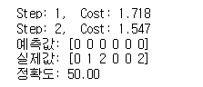
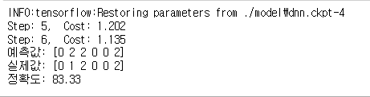

## 학습 모델
### 학습 모델 저장하고 재사용하기
>데이터를 파일을 별개로(data.csv) 분리하여 유연성을 늘리고 이전에 학습했던 내용을 저장 하고 가져와 지속성을 늘린다.

```
#1
import tensorflow as tf
import numpy as np


data = np.loadtxt('./data.csv', delimiter=',',
                  unpack=True, dtype='float32')

# 털, 날개, 기타, 포유류, 조류
# x_data = 0, 1
# y_data = 2, 3, 4
x_data = np.transpose(data[0:2])
y_data = np.transpose(data[2:])


#########
# 신경망 모델 구성
######
# 학습에 직접적으로 사용하지 않고 학습 횟수에 따라 단순히 증가시킬 변수를 만듭니다.
#2
global_step = tf.Variable(0, trainable=False, name='global_step')

#3
X = tf.placeholder(tf.float32)
Y = tf.placeholder(tf.float32)

W1 = tf.Variable(tf.random_uniform([2, 10], -1., 1.))
L1 = tf.nn.relu(tf.matmul(X, W1))

W2 = tf.Variable(tf.random_uniform([10, 20], -1., 1.))
L2 = tf.nn.relu(tf.matmul(L1, W2))

W3 = tf.Variable(tf.random_uniform([20, 3], -1., 1.))
model = tf.matmul(L2, W3)

cost = tf.reduce_mean(
    tf.nn.softmax_cross_entropy_with_logits_v2(labels=Y, logits=model))

optimizer = tf.train.AdamOptimizer(learning_rate=0.01)
# global_step로 넘겨준 변수를, 학습용 변수들을 최적화 할 때 마다 학습 횟수를 하나씩 증가시킵니다.
train_op = optimizer.minimize(cost, global_step=global_step)


#########
# 신경망 모델 학습
######
#4
sess = tf.Session()
# 모델을 저장하고 불러오는 API를 초기화합니다.
# global_variables 함수를 통해 앞서 정의하였던 변수들을 저장하거나 불러올 변수들로 설정합니다.
saver = tf.train.Saver(tf.global_variables())

#5
ckpt = tf.train.get_checkpoint_state('./model')
if ckpt and tf.train.checkpoint_exists(ckpt.model_checkpoint_path):
    saver.restore(sess, ckpt.model_checkpoint_path)
else:
    sess.run(tf.global_variables_initializer())

# 최적화 진행
#6
for step in range(2):
    sess.run(train_op, feed_dict={X: x_data, Y: y_data})

    print('Step: %d, ' % sess.run(global_step),
          'Cost: %.3f' % sess.run(cost, feed_dict={X: x_data, Y: y_data}))

# 최적화가 끝난 뒤, 변수를 저장합니다.
#7
saver.save(sess, './model/dnn.ckpt', global_step=global_step)

#########
# 결과 확인
# 0: 기타 1: 포유류, 2: 조류
######
#8
prediction = tf.argmax(model, 1)
target = tf.argmax(Y, 1)
print('예측값:', sess.run(prediction, feed_dict={X: x_data}))
print('실제값:', sess.run(target, feed_dict={Y: y_data}))

is_correct = tf.equal(prediction, target)
accuracy = tf.reduce_mean(tf.cast(is_correct, tf.float32))
print('정확도: %.2f' % sess.run(accuracy * 100, feed_dict={X: x_data, Y: y_data}))

```
1.파일 가져오기
>1,2열은 x_data, 3열부터 마지막열까지 y_data 그 다음 transpose 로 행과 열을 바꿔줌  
  
2.변수 설정
> 학습을 하지않아 trainalbe=False 로 변수 설정  

3.모델 구성
>계층수와 은닉층의 뉴런 수를 늘리면 복잡도가 높은 문제를 해결할 수 있다. 하지만 무조건 적이지 않으면 과접합 문제에 빠질 수 있다. global_step 매개변수에 앞서 정의한 global_step 변수를 넘겨주면 최적화 함수가 학습용 변수들을 최적화할 때마다 global_step 값을 1씩 증가시킴

4.모델을 부르고 저장
> tf.global_variables() 를 이용해 앞서 정의한 변수를 가져옴.

5.학습된 값 로드
> ./model 디렉토리에 기존에 학습한 모델 유무 확인. 있을시 saver.restore 함수를 사용해 학습된 값 로드 아니면 변수 초기화. 학습된 모델을 저장한 파일을 체크포인트파일(checkpoint file) 이라함.

6.최적화 수행

7.학습된 변수를 체크포인트 파일에 저장

8.예측 결과 및 정확도 출력

* 에러발생  
체크포인트가 없다는 에러가 뜨는경우가 있는데 이는 tf.reset_default_graph() 를 사용한다.

 #### 테스트 결과


여러번 학습 시킬 수 록 정확도가 올라감을 확인할 수 있다.

### 텐서보드 사용
>학습 과정 추적을 해준다. 학습하는 중간중간 손실값이나 정확도, 결과물을 다양한 방식으로 시각화하여 보여준다.


```
#1
import tensorflow as tf
import numpy as np

tf.reset_default_graph()

data = np.loadtxt('./data.csv', delimiter=',',
                 unpack=True, dtype='float32')

x_data = np.transpose(data[0:2])
y_data = np.transpose(data[2:])

global_step = tf.Variable(0, trainable=False, name='global_step')

X=tf.placeholder(tf.float32)
Y=tf.placeholder(tf.float32)

#2
with tf.name_scope('layer1'):
    W1 = tf.Variable(tf.random_uniform([2,10], -1., 1.), name='W1')
    L1 = tf.nn.relu(tf.matmul(X,W1))
    
with tf.name_scope('layer2'):
    W2 = tf.Variable(tf.random_uniform([10,20],-1,1.), name='W2')
    L2 = tf.nn.relu(tf.matmul(L1,W2))
    
with tf.name_scope('layer3'):
    W3 = tf.Variable(tf.random_uniform([20,3],-1.,1.), name='W3')
    model = tf.matmul(L2,W3)
    
with tf.name_scope('optimizer'):
    cost =tf.reduce_mean(tf.nn.softmax_cross_entropy_with_logits_v2(labels=Y, logits=model))
    
    optimizer = tf.train.AdamOptimizer(learning_rate=0.01)
    train_op = optimizer.minimize(cost, global_step=global_step)
    
    #3
    tf.summary.scalar('cost',cost)
    
#4
sess =tf.Session()
saver = tf.train.Saver(tf.global_variables())

ckpt = tf.train.get_checkpoint_state('./model')
if ckpt and tf.train.checkpoint_exists(ckpt.model_checkpoint_path):
    saver.restore(sess, ckpt.model_checkpoint_path)
else:
    sess.run(tf.global_variables_initializer())
    
#5
merged = tf.summary.merge_all()
writer = tf.summary.FileWriter('./logs',sess.graph)

#6
for step in range(100):
    sess.run(train_op, feed_dict={X: x_data, Y: y_data})
    
    print('Step: %d, ' % sess.run(global_step),
         'Cost:%.3f' % sess.run(cost, feed_dict={X: x_data, Y: y_data}))
    
    #7
    summary = sess.run(merged, feed_dict={X: x_data, Y: y_data})
    writer.add_summary(summary, global_step=sess.run(global_step))

#8
saver.save(sess, './model/dnn.ckpt', global_step=global_step)

prediction = tf.argmax(model,1)
target = tf.argmax(Y,1)
print('예측값:', sess.run(prediction, feed_dict={X: x_data}))
print('실제값:', sess.run(target, feed_dict={Y: y_data}))

is_correct = tf.equal(prediction, target)
accuracy = tf.reduce_mean(tf.cast(is_correct, tf.float32))
print('정확도: %.2f' % sess.run(accuracy * 100, feed_dict={X: x_data, Y: y_data}))
```

1.데이터를 읽어서 값을 넣음  
2.계층 묶기  
>with tf.name_scope로 묶어 계층 내부를 표현할 수 있게 한다. 그리고 변수에 이름을 붙여 변수가 어디서 사용되는지 쉽게 확인한다.  

3.손실값 추적  
>scalar 함수는 값이 하나인 텐서를 수집할때 이용

4.모델 로드 또는 초기화  
5.텐서 수집  
>merge_all 함수로 텐서를 수집하고 FileWriter 함수를 이ㅛㅇ해 그래프와 텐서 값을 저장할 디렉토리 설정

6.최적화   
7.저장  
>merged로 모아둔 텐서의 값들을 계산하고 수집한뒤 add_summary함수를 이용해 앞서 지정한 디렉토리에 저장하고 global_step값을 이용해 수집 시점 기록

8.모델 저장 및 예측

### 텐서보드 실행
```
tensorboard --logdir=./logs
```
위 코드를 이용하면 웹서버가 나오고 이에 들어가 확인한다