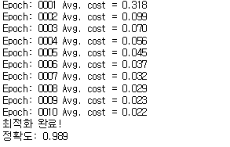

### CNN
이미지, 음성인식, 자연어 처리에 많이 사용된다.  
CNN 모델은 컨볼루션 계층과 풀링 계층으로 이루어 진다.
* 컨볼루션 계층  
가중치와 편향을 적용하는 계층. 컨볼루션에서은 원본에서 지정한 크기의 영역을 가져오는데 이 영역을 '윈도우' 라고 한다. 그리고 이 '윈도우' 를 움직이면서 은닉층을 완성한다. 몇 칸씩 움직일지 정하는 값을 '스트라이드'(stride) 라고 한다. 이때 가중치는 윈도우 크기만큼의 개수와 1개의 편향이 필요하다. 이 가중치와 편향을 커널(kernel) 또는 필터(filter) 라고 한다. 이 커널은 모든 윈도우에 적용이 된다.  
=>윈도우 크기만큼 가중치가 필요하기때문에 기본 신경망보다 훨씬 더 적은 가중치를 찾아내기만 하면되서 계산량이 적다. 복잡한 이미지의 경우는 여러 개의 커널을 사용한다. 커널의 개수 또한 하이퍼파라미터의 하나로써 이를 정하는것도 중요하다.

* 풀링 계층  
컨볼루션 계층을 거쳐서 만들어진 은닉층에서 임의의 값을 가져와서 만든다.


사용
> tfCNN.ipynb


코드
```
import tensorflow as tf
tf.logging.set_verbosity(tf.logging.ERROR)
old_v = tf.logging.get_verbosity()

from tensorflow.examples.tutorials.mnist import input_data
mnist = input_data.read_data_sets("./mnist/data/", one_hot = True)

#1
X = tf.placeholder(tf.float32, [None, 28, 28, 1])
Y = tf.placeholder(tf.float32, [None, 10])
keep_prob = tf.placeholder(tf.float32)

#2
W1 = tf.Variable(tf.random_normal([3,3,1,32], stddev=0.01))
L1 = tf.nn.conv2d(X,W1,strides=[1,1,1,1], padding='SAME')
L1 = tf.nn.relu(L1)
#3
L1 = tf.nn.max_pool(L1, ksize=[1,2,2,1], strides=[1,2,2,1], padding='SAME')


#4
W2 = tf.Variable(tf.random_normal([3,3,32,64], stddev=0.01))
L2 = tf.nn.conv2d(L1,W2,strides=[1,1,1,1], padding='SAME')
L2 = tf.nn.relu(L2)
L2 = tf.nn.max_pool(L2, ksize=[1,2,2,1], strides=[1,2,2,1],padding='SAME')

#5
W3 = tf.Variable(tf.random_normal([7*7*64, 256], stddev=0.01))
L3 = tf.reshape(L2,[-1,7*7*64])
L3 = tf.matmul(L3,W3)
L3 = tf.nn.relu(L3)
L3 = tf.nn.dropout(L3, keep_prob)

#6
W4 = tf.Variable(tf.random_normal([256,10], stddev=0.01))
model = tf.matmul(L3,W4)

#7
cost = tf.reduce_mean(tf.nn.softmax_cross_entropy_with_logits_v2(logits=model, labels=Y))
optimizer = tf.train.AdamOptimizer(0.001).minimize(cost)

#8
init = tf.global_variables_initializer()
sess = tf.Session()
sess.run(init)

batch_size = 100
total_batch = int(mnist.train.num_examples / batch_size)

for epoch in range(10): 
    total_cost = 0
    
    for i in range(total_batch):
        batch_xs, batch_ys = mnist.train.next_batch(batch_size)
        batch_xs = batch_xs.reshape(-1,28,28,1)
        
        _, cost_val = sess.run([optimizer, cost],
                              feed_dict = {X: batch_xs,
                                            Y: batch_ys,
                                            keep_prob : 0.8})
        
        total_cost += cost_val
        
    print('Epoch:', '%04d' % (epoch+1),
         'Avg. cost =' ,'{:.3f}'.format(total_cost/total_batch))
    
print('최적화 완료!')

is_correct = tf.equal(tf.argmax(model, 1), tf.argmax(Y,1))
accuracy =tf.reduce_mean(tf.cast(is_correct, tf.float32))
print('정확도:', sess.run(accuracy, feed_dict={X: mnist.test.images.reshape(-1,28,28,1),
                                           Y: mnist.test.labels,
                                           keep_prob: 1}))
```

1. 플레이스홀더 설정  
X : 입력값인 MNIST 파일크기가 28X28 이고 색깔은 하나이므로 28,28,1  
Y : 출력값인 0부터 9이므로 10개  
keep_prod : 드롭아웃용

2. CNN계층 구성  
W1 : 3X3X1 윈도우로 된 32개의 커널을 만들기위한 가중치 설정  
L1 : padding = 'SAME' 으로 커널 슬라이딩 시 이미지의 가장 외곽에서 한 칸 밖으로 움직이는 옵션, strides 는 오른쪽과 아래쪽으로 한 칸씩 움직임.

3. 풀링 계층 생성  
커널 크기가 2X2 인 풀링 계층 생성. strides 는 슬라이딩 시 두 칸씩 움직임.

4. 두 번째 계층  
32개의 커널을 64개의 커널로 확장

5. 10개의 분류를 만들어내는 계층  
10개의 분류는 1차원이므로 tf.reshape 함수를 통해 7*7*64 크기의 1차원 계층으로 만듬. 그 다음 256개의 뉴런으로 연결하는 신경망을 만듬.

6. 모델 최종 구성  
최종 출력 레이블로 연결함으로써 모델 구성

7. 손실 함수와 최적화 함수 생성

8. 학습 결과 확인 코드

#### 테스트 결과
