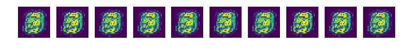
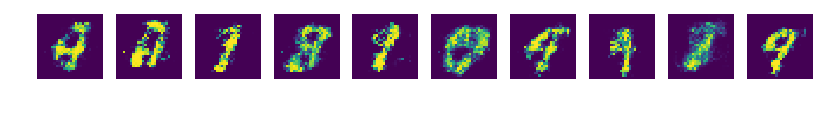
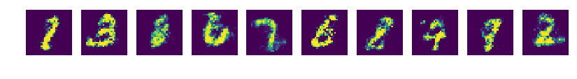
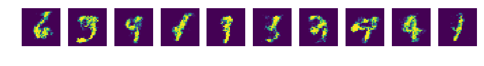
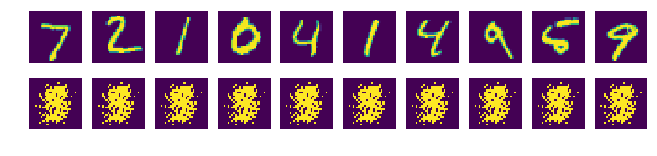
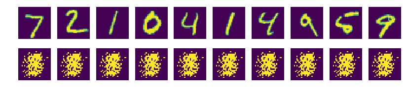

### GAN  
대립하는 두 신경망을 경쟁시켜서 학습시키는 방법  
위조지페범과 경찰이 있을때 위조지폐범은 경찰을 속이려고 노력을 할 것이고, 경찰은 이를 감별할려고 노력할 것이다. 위조지폐범이 경찰과 계속 싸우면서 결국엔 진짜 지폐와 같은 위조지폐를 만들 수 있다.  

위 비유에 따라서  
구분자(Discriminator) 에게 실제 이미지를 준다. 그 다음 생성자(Generator)가 노이즈로부터 임의의 이
미지를 만들고 이것을 구분자에게 준다. 구분자는 진짜인지 가짜인지 판단한다. 


#### 사용  
tfGAN.ipynb


#### 코드
```
#1
import tensorflow as tf
import matplotlib.pyplot as plt
import numpy as np

tf.logging.set_verbosity(tf.logging.ERROR)
old_v = tf.logging.get_verbosity()

from tensorflow.examples.tutorials.mnist import input_data
mnist = input_data.read_data_sets("./mnist/data/", one_hot=True)

#2
total_epoch =100
batch_size = 100
learning_rate = 0.0002
n_hidden = 256
n_input = 28 * 28
n_noise = 128

#3
X=tf.placeholder(tf.float32, [None, n_input])
Z=tf.placeholder(tf.float32, [None, n_noise])

#4
G_W1 = tf.Variable(tf.random_normal([n_noise,n_hidden], stddev=0.01))
G_b1 = tf.Variable(tf.zeros([n_hidden]))
G_W2 = tf.Variable(tf.random_normal([n_hidden,n_input], stddev=0.01))
G_b2 = tf.Variable(tf.zeros([n_input]))

#5
D_W1 = tf.Variable(tf.random_normal([n_input,n_hidden], stddev=0.01))
D_b1 = tf.Variable(tf.zeros([n_hidden]))
D_W2 = tf.Variable(tf.random_normal([n_hidden,1], stddev=0.01))
D_b2 = tf.Variable(tf.zeros([1]))

#6
def generator(noise_z):
    hidden = tf.nn.relu(tf.matmul(noise_z, G_W1) + G_b1)
    
    output = tf.nn.sigmoid(tf.matmul(hidden, G_W2) + G_b2)
    
    return output

#7
def discriminator(inputs):
    hidden = tf.nn.relu(tf.matmul(inputs, D_W1) + D_b1)
    
    output = tf.nn.sigmoid(tf.matmul(hidden, D_W2) + D_b2)
    
    return output

#8
def get_noise(batch_size, n_noise):
    return np.random.normal(size=(batch_size,n_noise))

#9
G= generator(Z)
D_gene = discriminator(G)
D_real = discriminator(X)

#10
loss_D = tf.reduce_mean(tf.log(D_real) + tf.log(1 - D_gene))
loss_G = tf.reduce_mean(tf.log(D_gene))

#11
D_var_list = [D_W1, D_b1, D_W2, D_b2]
G_var_list = [G_W1, G_b1, G_W2, G_b2]

train_D = tf.train.AdamOptimizer(learning_rate).minimize(-loss_D, var_list = D_var_list)
train_G = tf.train.AdamOptimizer(learning_rate).minimize(-loss_G, var_list = G_var_list)

#12
sess = tf.Session()
sess.run(tf.global_variables_initializer())

total_batch = int(mnist.train.num_examples / batch_size)
loss_val_D, loss_val_G = 0, 0

for epoch in range(total_epoch):
    for i in range(total_batch):
        batch_xs, batch_ys = mnist.train.next_batch(batch_size)
        noise = get_noise(batch_size, n_noise)
        
        _,loss_val_D = sess.run([train_D, loss_D],
                               feed_dict={X: batch_xs, Z: noise})
        _,loss_val_G = sess.run([train_G, loss_G],
                               feed_dict={Z:noise})
        
    print('Epoch', '%04d' % epoch,
             'D loss: {:.4}'.format(loss_val_D),
             'G loss: {:.4}'.format(loss_val_G))
        
        
    #13
    if epoch == 0 or (epoch+1) %10 == 0 :
        sample_size = 10
        noise = get_noise(sample_size, n_noise)
        samples = sess.run(G, feed_dict={Z:noise})
        
        fig, ax = plt.subplots(1, sample_size, figsize=(sample_size, 1))
        
        for i in range(sample_size):
            ax[i].set_axis_off()
            ax[i].imshow(np.reshape(samples[i],(28,28)))
            
            plt.savefig('samples/{}.png'.format(str(epoch).zfill(3)), bbox_inches='tight')
            
            plt.close(fig)
            
            
print('최적화 완료!')

```

1. 라이브러리 임포트

2. 하이퍼파라미터 설정

3. 플레이스홀더 설정  
비지도 학습이므로 Y를 사용하지 않는다. 구분자에 넣을 실제 이미지와 생성자가 만들 가짜이미지 두 개를 사용한다. 

4. 생성자 신경망 변수 설정  

5. 구분자 신경망에 사용할 변수 설정  
구분자는 진짜와 얼마나 가까운가를 판단하는 값으로 0~1 사이의 값을 출력한다. 그래서 스칼라 값 하나를 출력하도록 구성했다.

6. 생성자 신경망 함수 작성

7. 구분자 신경망 함수 작성  
0~1 사이의 스칼라값 하나를 출력하기 위해 활성화 함수로 sigmoid 함수를 사용

8. 노이스 함수 작성  
무작위한 노이즈를 만들어주는 함수를 만든다.

9. 생성자 만들기  
노이즈 Z를 이용해 가짜 이미지를 만들 생성자 G를 만든다. 이 G가 만든 가짜 이미지와 진짜 이미지 X를 각각 구분자에 넣어 입력한 이미지가 진짜인지 판별한다.

10. 손실값  
생성자가 만든 이미지를 구분자가 가짜라고 판단하도록 하는 손실값(경찰 학습용) 과 진짜라고 판단하도록 하는 손실값(위조지폐범 학습용)을 구한다. 경찰을 학습시키기 위해 진짜 이미지 판별값 D_real 은 1에 가까워야 하고, 가짜 이미지 판별값 D_gene 는 0에 가까워야 된다.  
구분자의 손실값은 'D_real'과 '1에서 D_gene을 뺀 값' 을 더한 값이다. 이 값을 최대화하면 학습이 이루어진다.  
생성자는 가짜 이미지 판별값 D_gene을 1에 가깝게 만든다.(가짜이미지를 넣어도 진짜같다고 판별) loss_D 와 loss_G는 서로 연관되어 있어서 loss_D가 증가하면 loss_G 는 하락하고 반대의 경우도 마찬가지인 경쟁관계이다.

11. 손실값 이용한 학습  
최댓값을 구해야되서 최소값을 구하는 함수의 매개 변수 loss_D와 loss_G 에 음수 부호를 붙여주었다.

12. 학습
구분자와 생성자 신경망을 각각 학습 시킨다

13. 출력


#### 테스트 결과
0회  
  
39회  
   
69회  
  
99회  
  


### 원하는 숫자 생성
노이즈에 레이블 데이터를 힌트로 넣어주는 방법을 사용하였다.

#### 사용
tfGAN2.ipynb

#### 코드
```

import tensorflow as tf
import matplotlib.pyplot as plt
import numpy as np

tf.logging.set_verbosity(tf.logging.ERROR)
old_v = tf.logging.get_verbosity()

from tensorflow.examples.tutorials.mnist import input_data
mnist = input_data.read_data_sets("./mnist/data/", one_hot=True)

#1
total_epoch =100
batch_size = 100
n_hidden = 256
n_input = 28 * 28
n_noise = 128
n_class = 10


X=tf.placeholder(tf.float32, [None, n_input])
Y=tf.placeholder(tf.float32, [None, n_class])
Z=tf.placeholder(tf.float32, [None, n_noise])

#2
def generator(noise, labels):
    with tf.variable_scope('generator'):
        inputs = tf.concat([noise, labels], 1)
        
        hidden = tf.layers.dense(inputs, n_hidden, activation=tf.nn.relu)
    
        output = tf.layers.dense(hidden, n_input, activation=tf.nn.sigmoid)
    
    return output

#3
def discriminator(inputs, labels, reuse=None):
    with tf.variable_scope('discriminator') as scope:
        if reuse:
            scope.reuse_variables()
            
        inputs = tf.concat([inputs, labels], 1)
            
        hidden = tf.layers.dense(inputs, n_hidden, activation= tf.nn.relu)
            
        output = tf.layers.dense(hidden, 1, activation=None)
    
    return output

#4
def get_noise(batch_size, n_noise):
    return np.random.normal(-1., 1., size=(batch_size,n_noise))

#5
G= generator(Z, Y)
D_real = discriminator(X, Y)
D_gene = discriminator(G, Y, True)

#6
loss_D_real = tf.reduce_mean(tf.nn.sigmoid_cross_entropy_with_logits(
    logits = D_real, labels= tf.ones_like(D_real)))
loss_D_gene = tf.reduce_mean(tf.nn.sigmoid_cross_entropy_with_logits(
    logits = D_gene, labels=tf.zeros_like(D_gene)))

loss_D = loss_D_real + loss_D_gene

#7
loss_G = tf.reduce_mean(tf.nn.sigmoid_cross_entropy_with_logits(
    logits = D_gene, labels=tf.ones_like(D_gene)))

#8
vars_D = tf.get_collection(tf.GraphKeys.TRAINABLE_VARIABLES,
                          scope='discriminator')
vars_G = tf.get_collection(tf.GraphKeys.TRAINABLE_VARIABLES,
                          scope='generator')

train_D = tf.train.AdamOptimizer().minimize(loss_D, var_list = vars_D)
train_G = tf.train.AdamOptimizer().minimize(loss_G, var_list = vars_G)

#9
sess = tf.Session()
sess.run(tf.global_variables_initializer())

total_batch = int(mnist.train.num_examples / batch_size)
loss_val_D, loss_val_G = 0, 0

for epoch in range(total_epoch):
    for i in range(total_batch):
        batch_xs, batch_ys = mnist.train.next_batch(batch_size)
        noise = get_noise(batch_size, n_noise)
        
        _,loss_val_D = sess.run([train_D, loss_D],
                               feed_dict={X: batch_xs, Y: batch_ys, Z: noise})
        _,loss_val_G = sess.run([train_G, loss_G],
                               feed_dict={Y: batch_ys, Z:noise})
        
    print('Epoch', '%04d' % epoch,
             'D loss: {:.4}'.format(loss_val_D),
             'G loss: {:.4}'.format(loss_val_G))
        
        
    #13
    if epoch == 0 or (epoch+1) %10 == 0 :
        sample_size = 10
        noise = get_noise(sample_size, n_noise)
        samples = sess.run(G, feed_dict={Y: mnist.test.labels[:sample_size], Z:noise})
        
        fig, ax = plt.subplots(2, sample_size, figsize=(sample_size, 2))
        
        for i in range(sample_size):
            ax[0][i].set_axis_off()
            ax[1][i].set_axis_off()
            ax[0][i].imshow(np.reshape(mnist.test.images[i],(28,28)))
            ax[1][i].imshow(np.reshape(samples[i],(28,28)))
            
        plt.savefig('samples2/{}.png'.format(str(epoch).zfill(3)), bbox_inches='tight')
            
        plt.close(fig)
            
            
print('최적화 완료!')

```

1. 기본 설정  
플레이스홀더로 Y를 추가 하였다. 노이즈와 실제 이미지에 각각에 해당하는 숫자를 힌트로 넣어주는 용도로 사용한다.

2. 생성자 신경망 구성  
변수를 선언하지 않고 tf.layers 를 사용했다. 이를 사용하면 tf.variable.scope 를 이용해 스코프를 지정해두고 나중에 스코프에 해당하는 변수들만 따로 불러서 쓸 수 있다.  
tf.concat 함수를 이용해 noise 값에 labels 정보를 추가한다. 그리고 tf.layers.dense 함수를 이용해 은닉층과 출력층을 만든다.

3. 구분자 신경망 구성  
구분자는 진짜 이미지를 판별할 때와 가짜 이미지를 판별할 때 똑같은 변수(가중치, 편향)를 사용해야 한다. 그래서 scope.reuse_variables() 함수를 이용해 이전에 사용한 변수를 재사용하도록 한다.   
출력값 함수에 함수를 사용하지 않았는데, 이는 손실값 계산을 다르게 쓰기위해서다.

4. 노이즈 생성  
여기서는 균등분포로 생성한다

5. 생성자, 구분자 생성  
진짜 이미지 구분자에서 사용한 변수들을 재사용 하도록 reuse 옵션을 켜준다.

6. 구분자 손실함수 작성  
sigmoid_cross_entropy_with_logits 함수를 이용하여 작성한다.
D_real은 1에 가까워야하고 D_gene은 0에 가까워야 한다.

7. 생성자 손실함수 작성  
D_gene 를 1에 가깝게 만드는 값을 손실값으로 취하도록 한다.

8. 최적화
tf.get_collection 함수를 이용해 discriminator 와 generator 스코프에서 사용된 변수를 가져온 뒤, 이 변수들을 최적화에 사용할 각각의 손실 함수와 함께 최적화 함수에 넣어 학습 모델을 구성한다.

9. 학습 진행

10. 출력

#### 테스트 결과  
0회  
  
39회  
  
69회  
  
99회  
  

* 뭔가 잘못된건가..