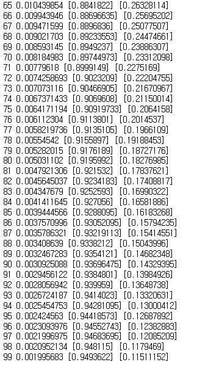
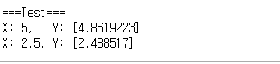

### 선형 회귀
>입력을 통해 출력을 예측하는 것. 선형 회귀에서는 x, y가 주어졌을 때 이를 통해 함수를 예측한다. 그러면 새로운 x가 주어줘도 옳은 y의 값을 찾을 수 있다.

```
import tensorflow as tf

x_data = [1, 2, 3]
y_data = [1, 2, 3]

#1
W = tf.Variable(tf.random_uniform([1], -1.0, 1.0))
b = tf.Variable(tf.random_uniform([1], -1.0, 1.0))

#2
X = tf.placeholder(tf.float32, name="x")
Y = tf.placeholder(tf.float32, name="Y")

#3
hypothesis = W*X+b

#4
cost = tf.reduce_mean(tf.square(hypothesis - Y))
#5
optimizer = tf.train.GradientDescentOptimizer(learning_rate = 0.1)
train_op = optimizer.minimize(cost)

#6
with tf.Session() as sess:
    sess.run(tf.global_variables_initializer())

    for step in range(100):
        _, cost_val = sess.run([train_op, cost], feed_dict={X: x_data, Y: y_data})

    print(step, cost_val, sess.run(W),sess.run(b))


#7
    print("X: 5, Y:",sess.run(hypothesis, feed_dict={X: 5}))
    print("X: 2.5, Y:",sess.run(hypothesis, feed_dict={X: 2.5}))
```

1.값 초기화
> 균등분포(Uniform Distribution)를 가진 무작위 값(-1~ 1)로 초기화  

2.플레이스홀더 설정
> name을 통해 플레이스홀더의 이름을 설정(이름 부여시 어떻게 사용되는지 알 수 있음, 디버깅 편리)  

3.수식 설정
> 수식에서의 W(가중치(weight)), b(편향(bias)) 을 찾기 위함  

4.손실 함수(loss function) 설정
>실제값과 모델로 예측한 값의 차이인 손실값을 구하기 위함. 이 손실을 전체 데이터에서 구한것이 '비용(cost)' 이다. 학습은 이 손실값을 최소화하기 위한 W, b를 찾는것이다.  

5.손실값 최소화
>위는 경사하강법(gradient descent)를 이용해 최적화함. learning rate 는 학습률로 학습 속도를 조절한다. 이는 학습 진행 과정에 영향을 주는 변수 하이퍼파라미터(hyperparameter) 라 하여 신경망 성능을 조절한다.  

6.세션 생성
>with 기능을 통해 세션 블록을 만듬(세션 종료를 자동으로 처리한다)  

7.다른 변수 대입
>학습에 사용되지 않았던 새로운 X를 넣고 결과를 확인한다.

#### 테스트 결과
##### 학습 확인(손실값 점진적 감소)
  

##### 학습 후 새로운 X값 테스트
