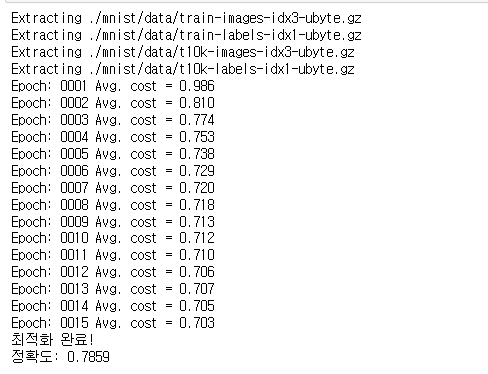
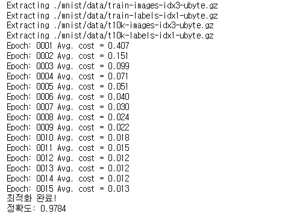
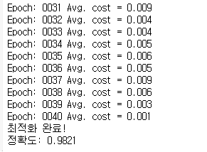
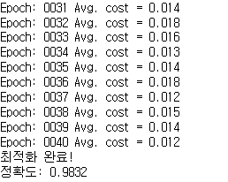
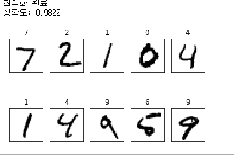

### MNIST
>머신 러닝계의 Hello world!  
28X28 픽셀 크기로 된 손글씨 숫자 이미지를 모아놓은 데이터셋이다.

사용
> tfMnist.ipynb  
mnist폴더(없을시 실행하면 자동생성)

```
#1
import tensorflow as tf
tf.logging.set_verbosity(tf.logging.ERROR)
old_v = tf.logging.get_verbosity()

from tensorflow.examples.tutorials.mnist import input_data
mnist = input_data.read_data_sets("./mnist/data/", one_hot=True)

#2
X=tf.placeholder(tf.float32, [None, 784])
Y=tf.placeholder(tf.float32, [None,10])

W1=tf.Variable(tf.random_normal([784, 256], stddev=0.01))
L1=tf.nn.relu(tf.matmul(X,W1))

W2=tf.Variable(tf.random_normal([256, 256], stddev=0.01))
L2=tf.nn.relu(tf.matmul(L1,W2))

W3=tf.Variable(tf.random_normal([256,10],stddev=0.01))
model=(tf.matmul(L2,W3))

#3
cost = tf.reduce_mean(tf.nn.softmax_cross_entropy_with_logits_v2(logits=model, labels=Y))
optimizer =tf.train.AdamOptimizer(0.001).minimize(cost)

#4
init = tf.global_variables_initializer()
sess=tf.Session()
sess.run(init)

#5
batch_size=100
total_batch = int(mnist.train.num_examples/batch_size)

for epoch in range(15):
    total_cost = 0
    
    for i in range(total_batch):
        batch_xs, batch_ys = mnist.train.next_batch(batch_size)
        
        _, cost_val = sess.run([optimizer, cost],
                              feed_dict={X: batch_xs, Y: batch_ys})
        total_cost += cost_val
        
    print('Epoch:', '%04d' % (epoch + 1),
         'Avg. cost =', '{:.3f}'.format(total_cost/total_batch))
    

print('최적화 완료!')

#6
is_correct = tf.equal(tf.argmax(model,1),tf.argmax(Y,1))
#7
accuracy = tf.reduce_mean(tf.cast(is_correct, tf.float32))
print('정확도:', sess.run(accuracy, feed_dict = {X: mnist.test.images,
                                                 Y: mnist.test.labels}))
```

1. 데이터 가져오기
>텐서 플로에서 MNIST를 가져오는 경우 오류가 날 수 있는데 이의 경우 tf.logging 모듈을 삽입해서 해결한다.  
  
2. 신경망 모델 구성
>입력값인 이미지가 28X28 이므로 총 784개의 특징으로 이루어져있다. 출력값으로는 0부터 9까지 이므로 10개의 분류로 나뉜다.

2. 1 미니배치
>데이터를 한꺼번에 여러개를 학습할려면 컴퓨터의 성능이 좋아야된다. 그래서 데이터를 적당한 크기로 잘라서 학습하는것이 minibatch 이다.  
X, Y 의 첫번째 차원이 None 으로 되어있다. 이 자리는 한 번에 학습시킬 MNIST 이미지의 개수를 지정하는 값이 들어간다. (배치크기) None 일시 텐서플로가 알아서 계산해서 넣어준다.  
tf.random_normal([256,10],stddev=0.01) 는 표준편차가 0.01인 정규분포를 가지는 임의의 값으로 변수를 초기화한다.

* 출력층에는 활성화 함수를 잘 사용하지 않는다.

3. 손실값 계산
>tf.nn.softmax_cross_entropy_with_logits_v2 함수를 사용해 '각' 이미지에 대한 손실값을 구함. tf.reduce_mean 함수를 이용해 미니배치의 평균 손실값을 구함. tf.train.AdamOptimizer 함수를 이용해 손길값을 최소화하는 최적화 수행

4. 학습 세션 시작
>신경망 모델 초기화 및 세션 시작

*테스트용 데이터?
>학습 데이터는 학습 시킬 때 사용  
테스트 데이터는 학습이 잘 되었는지 확인하는데 사용  
학습 데이터로 학습하고 학습 데이터로 예측하면 정확도가 당연히 높다. 하지만 학습 데이터에 포함되지 않는 데이터로 예측을 해야지 의미가 있다. 그 데이터가 테스트 데이터이다. 이 테스트 데이터로 예측이 높지 못한것을 과적합(Overfitting) 이라 한다.

5. 배치 크기
>미니배치의 크기를 100개로 설정한다. 그리고 데이터의 총 개수에 미니배치 크기를 나누어 미니배치의 개수를 구한다.  
그 다음 데이터 전체를 15번 학습. 학습 데이터 전체를 한 바퀴 도는 것을 에포크(epoch) 라 한다.  
그 다음 반복문 안에서 미니배치의 총 개수만큼 반복하여 학습한다.

6. 정확도 계산
>tf.argmax(model,1) 은 model에서 첫번째 차원은 배치 크기, 두 번째 차원('1'번 인덱스 차원)은 결과값이 들어있다. 여기서 결과값의 최댓값 인덱스를 가져오는 함수이다. tf.argmax(Y,1) 도 실제 레이블에 해당하는 숫자를 가져온다.

7. 정확도 계산2
>tf.cast 를 이용해 is_correct를 0과 1로 변환한다. 그리고 그 값들을 tf.reduce_mean을 이용해 평균을 내어 정확도 텐서를 만든다.  
그 다음 테스트 이미지와 레이블 데이터를 넣어 정확도를 계산한다.


#### 테스트 결과



>전자의 경우 출력층에 활성화함수를 쓴 경우, 후자의 경우 쓰지 않은 경우이다. 활성화 함수의 사용에 주의하자!


### 드롭아웃
>학습 결과가 학습 데이터에 치중되어 있는 '과적합' 문제를 해결하기 위해 만들어진 방법  

>신경망 중 일부만 사용해 학습한다.  
그럼으로써 일부 특징이 특정 뉴런들에 고정되는 것을 막아 가중치의 균형을 잡도록 하여 과적합을 방지한다.

>단점 으로는 충분한 학습을 하는데 필요한 시간이 길다.

사용
>tfDropout.ipynb

```

import tensorflow as tf
tf.logging.set_verbosity(tf.logging.ERROR)
old_v = tf.logging.get_verbosity()

from tensorflow.examples.tutorials.mnist import input_data
mnist = input_data.read_data_sets("./mnist/data/", one_hot=True)


X=tf.placeholder(tf.float32, [None, 784])
Y=tf.placeholder(tf.float32, [None,10])
#1
keep_prob = tf.placeholder(tf.float32)

W1=tf.Variable(tf.random_normal([784, 256], stddev=0.01))
L1=tf.nn.relu(tf.matmul(X,W1))
#2
L1=tf.nn.dropout(L1, keep_prob)

W2=tf.Variable(tf.random_normal([256, 256], stddev=0.01))
L2=tf.nn.relu(tf.matmul(L1,W2))
L2=tf.nn.dropout(L2, keep_prob)

W3=tf.Variable(tf.random_normal([256,10],stddev=0.01))
model=(tf.matmul(L2,W3))


cost = tf.reduce_mean(tf.nn.softmax_cross_entropy_with_logits_v2(logits=model, labels=Y))
optimizer =tf.train.AdamOptimizer(0.001).minimize(cost)


init = tf.global_variables_initializer()
sess=tf.Session()
sess.run(init)


batch_size=100
total_batch = int(mnist.train.num_examples/batch_size)

for epoch in range(40):
    total_cost = 0
    
    for i in range(total_batch):
        batch_xs, batch_ys = mnist.train.next_batch(batch_size)
        
        #3
        _, cost_val = sess.run([optimizer, cost],
                              feed_dict={X: batch_xs, Y: batch_ys, keep_prob: 0.8})
        total_cost += cost_val
        
    print('Epoch:', '%04d' % (epoch + 1),
         'Avg. cost =', '{:.3f}'.format(total_cost/total_batch))
    

print('최적화 완료!')


is_correct = tf.equal(tf.argmax(model,1),tf.argmax(Y,1))

accuracy = tf.reduce_mean(tf.cast(is_correct, tf.float32))
print('정확도:', sess.run(accuracy, feed_dict = {X: mnist.test.images,
                                                 Y: mnist.test.labels,
                                                 keep_prob: 1}))
```

1. 플레이홀더 생성
>학습시의 사용할 뉴런의 비율과 예측 시에 사용할 뉴런의 비율은 다르기 때문에 플레이스홀더를 만들어 주었다.

2. 드롭아웃
>계층 구성 마지막에 tf.nn.dropout 함수를 사용해 드롭아웃 기법을 적용했다.

3. 드롭아웃 비율 설정
>학습시에는 사용할 뉴런을 0.8 로 설정 80% 뉴런만 사용했다. 그리고 예측시에는 뉴런을 전부 다 사용하게 해야되므로 1로 설정하였다.

#### 테스트 결과


>전자는 적용전, 후자는 적용후 이다. 후자의 경우가 좀 더 높은 정확도를 보였다. 드롭아웃 기법은 충분한 학습이 필요하므로 Epoch를 40까지 수행하였다. 전자는 과적합 문제때문에 학습을 많이 할시 오히려 정확도가 떨어질 수 있다.


* 배치 정규화(Batch Normalization) 기법
>과적합을 막고 학습 속도를 향상 시켜주는 기법  
tf.layer.batch_normalization 함수 사용

### Matplotlib
>시각화를 위해 그래프를 쉽게 그리게 해주는 파이썬 라이브러리

사용
>tfMatplot.ipynb

#### 테스트 결과
