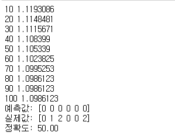
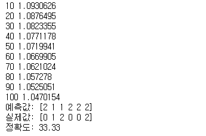
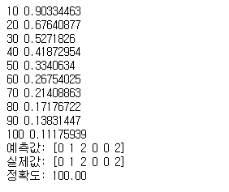

### 머신 러닝

#### 역전파(Backpropagation)  
>출력층의 결과의 오차를 신경망을 따라 입력층까지 역으로 전파하며 계산하는 방식. -> 유의미한 가중치 조절 방식

### 분류(Classification) 코드 분석
>기타, 포유류, 조류 에 대해 털과 날개의 유무를 학습하는 코드

```
#1
import tensorflow as tf
import numpy as np

#2
x_data=np.array([[0,0],[1,0],[1,1],[0,0],[0,0],[0,1]])

y_data = np.array([
    [1,0,0],
    [0,1,0],
    [0,0,1],
    [1,0,0],
    [1,0,0],
    [0,0,1]
])

#3
X = tf.placeholder(tf.float32)
Y = tf.placeholder(tf.float32)

W=tf.Variable(tf.random_uniform([2,3],-1.,1.))
b=tf.Variable(tf.zeros([3]))

L=tf.add(tf.matmul(X,W),b)
L=tf.nn.relu(L)

#4
model = tf.nn.softmax(L)
#5
cost = tf.reduce_mean(-tf.reduce_sum(Y*tf.log(model),axis=1))

#6
#경사하강법으로 최적화
optimizer = tf.train.GradientDescentOptimizer(learning_rate=0.01)
train_op = optimizer.minimize(cost)

#텐서플로의 세션 초기화
init = tf.global_variables_initializer()
sess = tf.Session()
sess.run(init)

#100번 학습 진행
for step in range(100) :
    sess.run(train_op,feed_dict={X: x_data, Y: y_data})
    
    #10번마다 손실값 출력
    if (step+1)%10 == 0:
        print(step+1, sess.run(cost, feed_dict={X: x_data, Y: y_data}))
        
#7
prediction = tf.argmax(model, axis = 1)
target = tf.argmax(Y, axis = 1)
print('예측값:', sess.run(prediction, feed_dict={X: x_data}))
print('실제값:', sess.run(target, feed_dict={Y: y_data}))

#8
is_correct = tf.equal(prediction, target)
accuracy = tf.reduce_mean(tf.cast(is_correct, tf.float32))
print('정확도: %.2f' % sess.run(accuracy*100, feed_dict={X: x_data, Y: y_data}))

```

1.Numpy
>수치해석용 파이썬 라이브러리  
  
2.학습 데이터 정의
>x_data : 털이 있는가? 없는가? / 날개가 있는가? 없는가?  
y_data : 기타, 포유류, 조류 (ont-hot encoding 으로 구성)  
  
3.모델 구성
> X, Y는 실측값(ground truth) 넣어서 학습  
> 마지막으로 활성화 함수 ReLu 에 넣어서 신경망 구성  
  
4.모델 구성
>출력값을 softmax 함수로 넣어서 사용하기 편하게 함  
softmax : 배열 내 결괏값들의 전체 합이 1이 되도록 구성해 확률로 사용  
  
5.손실 함수 작성
>교차 엔트로피(Cross-Entropy) 함수 사용 : 예측값과 실제값 사이의 확률 분포 차이를 계산한 값  
* reduce_xxx : 텐서의 차원을 줄여줌  
  
6.학습  
  
7.학습 결과 확인
>model은 확률로 구성되어 있기 때문에 argmax 함수를 이용함     

8.정확도 출력
>예측값과 실측값을 비교하여 얻은 true/ false 값을 tf.cast 함수를 이용해 0과 1로 바꾸어 평균을 내서 출력


#### 테스트 결과
##### 학습 확인1

##### 학습 확인2


>테스트 결과 실행할때마다 정확도가 들쑥날쑥이며 낮은 정확도를 보였다. 이는 신경망 층이 적은것으로 판단  
  


### 심층 신경망 (딥러닝)

```
#1
import tensorflow as tf
import numpy as np

#2
x_data=np.array([[0,0],[1,0],[1,1],[0,0],[0,0],[0,1]])

y_data = np.array([
    [1,0,0],
    [0,1,0],
    [0,0,1],
    [1,0,0],
    [1,0,0],
    [0,0,1]
])

#3
X = tf.placeholder(tf.float32)
Y = tf.placeholder(tf.float32)

W1 = tf.Variable(tf.random_uniform([2,10],-1.,1.))
b1 = tf.Variable(tf.zeros([10]))

W2 = tf.Variable(tf.random_uniform([10,3],-1.,1.))
b2 = tf.Variable(tf.zeros([3]))

L1=tf.add(tf.matmul(X,W1),b1)
L1=tf.nn.relu(L1)

#4
model = tf.add(tf.matmul(L1,W2),b2)

#5
cost = tf.reduce_mean(tf.nn.softmax_cross_entropy_with_logits_v2(labels=Y, logits=model))

#6
#경사하강법으로 최적화
optimizer = tf.train.AdamOptimizer(learning_rate=0.01)
train_op = optimizer.minimize(cost)

#텐서플로의 세션 초기화
init = tf.global_variables_initializer()
sess = tf.Session()
sess.run(init)

#100번 학습 진행
for step in range(100) :
    sess.run(train_op,feed_dict={X: x_data, Y: y_data})
    
    #10번마다 손실값 출력
    if (step+1)%10 == 0:
        print(step+1, sess.run(cost, feed_dict={X: x_data, Y: y_data}))
        
#7
prediction = tf.argmax(model, 1)
target = tf.argmax(Y, 1)
print('예측값:', sess.run(prediction, feed_dict={X: x_data}))
print('실제값:', sess.run(target, feed_dict={Y: y_data}))

#8
is_correct = tf.equal(prediction, target)
accuracy = tf.reduce_mean(tf.cast(is_correct, tf.float32))
print('정확도: %.2f' % sess.run(accuracy*100, feed_dict={X: x_data, Y: y_data}))
```

>은닉층을 추가(가중치가 편향 추가)하여 딥러닝을 구성  
* 은닝층의 뉴런 수 하이퍼파라미터와 은닉층의 출력값에 적용할 활성화함수는 신경망 모델을 만드는데 중요 요소

>손실 함수는 텐서플로가 제공하는 교차 엔트로피 함수를 사용하였고 최적화 함수로는 AdamOptimizer를 사용했는데 최적화 함수는 여러 종류가 있으므로 잘 사용해야됨  

#### 테스트 결과

